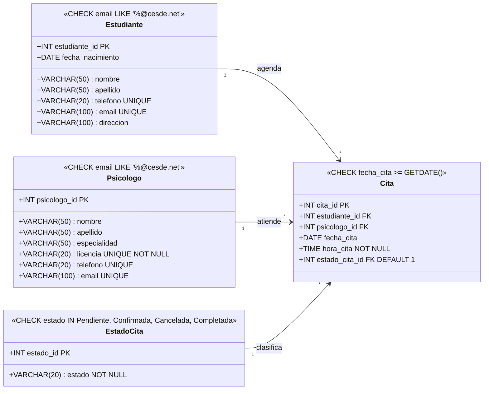

# 🧘 SerenityLab

> Plataforma digital académica para la administración integral de citas de atención psicológica, enfocada en el fortalecimiento del bienestar emocional estudiantil del CESDE.

---

## 📋 Descripción del Proyecto

**SerenityLab** es una plataforma web que centraliza los recursos de bienestar psicológico del CESDE, permitiendo a los estudiantes agendar citas con psicólogos de forma autónoma, rápida y sin barreras. Elimina la dependencia de canales tradicionales (llamadas, correos o visitas presenciales) que generaban retrasos en la atención, especialmente en momentos de estrés o crisis personales.

La plataforma diferencia dos roles principales: **Estudiante** y **Psicólogo**, cada uno con su propio panel de gestión. Está construida con una arquitectura de componentes reutilizables en **React**, estilizada con **Tailwind CSS** y empaquetada con **Vite** para máximo rendimiento.

### Objetivos

**General:** Desarrollar una plataforma accesible que permita a los estudiantes del CESDE gestionar de manera eficiente sus servicios de bienestar psicológico, simplificando el acceso a los recursos de apoyo institucional.

**Específicos:**
- Implementar un sistema de autenticación seguro con roles de **Estudiante** y **Psicólogo**.
- Desarrollar un módulo de agendamiento que consulte disponibilidad de profesionales en tiempo real.
- Optimizar la comunicación mediante recordatorios automáticos de citas.
- Centralizar la información del equipo profesional (especialidades y enfoques).

### Alcance

✅ **Incluido en esta versión:**
- Módulo de perfiles profesionales (especialidad, enfoque y descripción de cada psicólogo).
- Gestión de citas: selección de profesional, fecha y hora.
- Panel del Psicólogo: registro de disponibilidad y gestión de citas programadas.
- Dashboard del Estudiante: visualizar, guardar o cancelar citas.
- Notificaciones de confirmación y alertas de compromiso.

❌ **Fuera de alcance:**
- Canales de comunicación anónima o buzones de mensajes.
- Videollamadas integradas (se gestionarán por herramientas externas).
- Integración con historial académico o bases de datos de salud (EPS).

---

## 🛠️ Versiones de Software

| Herramienta       | Versión recomendada |
|-------------------|---------------------|
| Node.js           | >= 18.x             |
| npm               | >= 9.x              |
| Vite              | ^5.x                |
| React             | ^18.x               |
| React DOM         | ^18.x               |
| React Router DOM  | ^6.x                |
| Tailwind CSS      | ^3.x                |
| PostCSS           | ^8.x                |
| Autoprefixer      | ^10.x               |
| Git               | >= 2.x              |

---

## 🚀 Comandos de Instalación

Sigue los pasos a continuación para ejecutar el proyecto localmente sin errores:

### 1. Clonar el repositorio

```bash
git clone https://github.com/Sebaspino/SerenityLab-NT.git
cd SerenityLab-NT
```

### 2. Instalar dependencias

```bash
npm install
```

### 3. Iniciar el servidor de desarrollo

```bash
npm run dev
```

El proyecto estará disponible en: [http://localhost:5173](http://localhost:5173)

### 4. Generar build de producción

```bash
npm run build
```

### 5. Previsualizar build de producción

```bash
npm run preview
```

---

## 📁 Estructura del Proyecto

```
SerenityLab-NT/
├── node_modules/
├── public/
├── src/
│   ├── assets/               # Recursos estáticos: imágenes, logos y estilos globales
│   ├── components/           # Componentes de UI reutilizables (Navbar, Footer, Buttons)
│   ├── helpers/              # Funciones de utilidad (validaciones, formateo)
│   ├── pages/                # Vistas de alto nivel (Home, Login, etc.)
│   ├── router/               # Configuración de navegación (vacío por ahora)
│   ├── services/             # Lógica de comunicación con el Backend (vacío por ahora)
│   ├── App.css               # Estilos globales del componente raíz
│   ├── App.jsx               # Orquestador principal de la vista actual
│   ├── index.css             # Directivas de Tailwind (@tailwind base/components/utilities)
│   └── main.jsx              # Punto de entrada de React
├── .gitignore
├── eslint.config.js          # Configuración de reglas de linting
├── index.html                # HTML raíz de la aplicación
├── package-lock.json
├── package.json
├── README.md
└── vite.config.js            # Configuración de Vite
```

---

## 🗂️ Diagrama de Clases del Dominio (v1)

*Diagrama inicial del modelo de dominio – versión 1. Centrado en la relación Estudiante-Cita-Psicólogo.*



---

## 👥 Integrantes del Equipo

| Nombre             | Rol principal  | Usuario GitHub                                     |
|--------------------|----------------|----------------------------------------------------|
| Sebastian Pino     | Líder          | [@Sebaspino](https://github.com/Sebaspino)         |
| Jefferson Suaza    | Desarrollador  | [@Jesuazav](https://github.com/Jesuazav)           |
| Luisa Yepez        | Desarrolladora | [@Luisayepez567](https://github.com/Luisayepez567)  |

---

## 📄 Licencia

Este proyecto fue desarrollado con fines académicos para el CESDE.